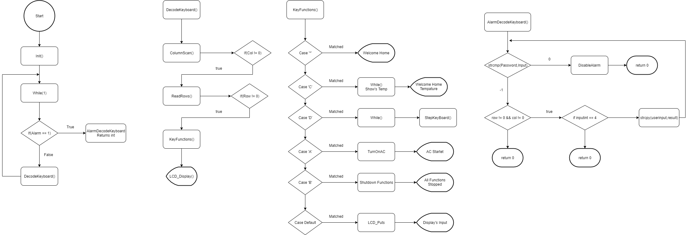
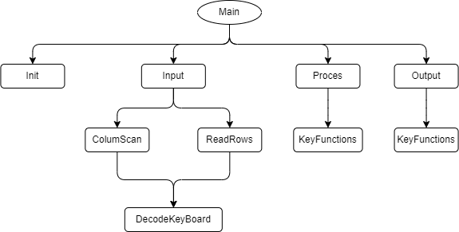

# Det intelligente hus 

## Opbygget med

[Atmel Studio 7.0](https://www.microchip.com/mplab/avr-support/atmel-studio-7)

[Tera Term](https://tera-term.en.lo4d.com/windows)

[Ilearn](https://ilearn.eucsyd.dk/my/)

[Doxygen](http://www.doxygen.nl/)

## Case

[Casen](https://ilearn.eucsyd.dk/mod/page/view.php?id=166708), ud fra opgaven har jeg valgt at sku lave en home controller som, indholder functionerne.
1. Alarm ved forsøg af indbrud.
2. Deaktivering af Alarm, med kode ord.
3. Aircondition.
4. Luk GaragePort.
5. Temparatur Måler.
6. Menu via et LCD Display.

### Functions

* Følg filvejen for at se alle functioner i programmet
* DetInteligenteHus/DetInteligenteHus/doxygen/html/globals_func.html

## Setup

* Arduino MEGA2560 R3 1stk
* Breadboard 1stk
* Switch 1stk
* LCD1602 1stk
* ADC Temperatur måler 1stk
* Pull up pin 1stk
* Keypad 1stk
* DC Motor 1stk
* StepMotor 1stk
* L293D chip 1stk
* Elegoo Strøm 1stk
* 10k Ressitance 2stk

## Installation
Look on the MEGApinout for the connections
### 1. KeyPad
* ColumeScan PK0-PK3
* RowRead PK4-PK7
### 2. LCD
* LCD_PORT = PORTH
* LCD_DATA0_PORT = LCD_PORT
* LCD_DATA1_PORT = PORTB
* LCD_DATA2_PORT = PORTB
* LCD_DATA3_PORT = PORTB
* LCD_DATA0_PIN = 6
* LCD_DATA1_PIN = 4
* LCD_DATA2_PIN = 5
* LCD_DATA3_PIN = 6
* LCD_RS_PIN = 4
* LCD_RW_PIN = 3
* LCD_E_PIN = 5
### 3. ADC
* ADC0D Pinout
### 4. Interupt
* interupt_PCINITX = PCINT0
### 5. Step 
* Step_PX0 = PC0
* Step_PX1 = PC1
* Step_PX2 = PC2
* Step_PX3 = PC3

## Float Chart

## Dokumentation Doxygen

* Følg filvejen for at se Dokumenationen 
* DetInteligenteHus/DetInteligenteHus/doxygen/html/index.html

## Hipo

## Creator
Martin Nørby Høj Jørgensen
